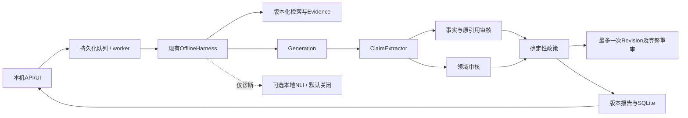
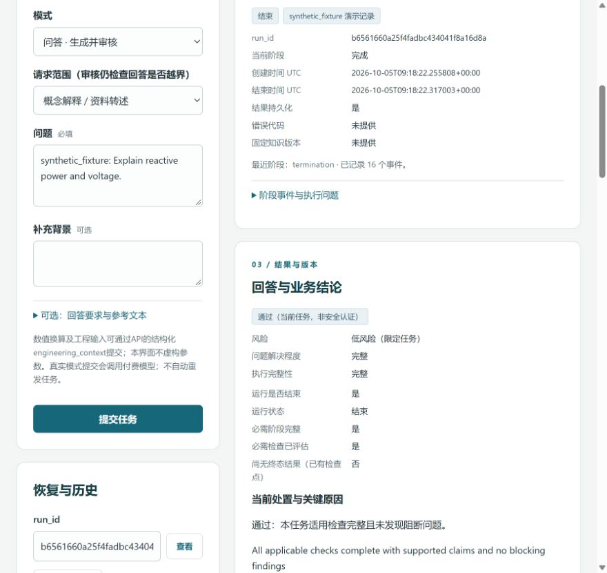
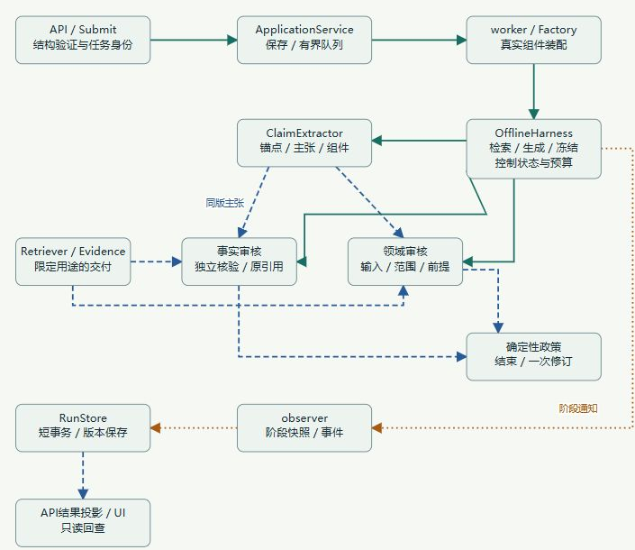

# PowerTrustAI

本地、单用户的电力知识问答与已有回答辅助审核原型。用户提问后检索、生成、逐主张事实/原引用与领域审核，按确定性政策处置；有定位和既有依据的局部错误最多一次修订、重提取并完整双审。模型意见、程序验证、工具及人工反馈分别保存。通过只表示满足当前任务审核条件，不能作为工程安全认证。

当前：首版审核收尾4/4真实任务完整执行：无goal新概念通过、设备100kVA缺依据被识别、危险建议明确高风险禁止采用；工程缺输入不编造，但回答偏长/部分语义待复核。可进入本人限定范围最终试用，不宣称稳定工程审核。[本轮验收与限制](docs/audit-closeout-v1.md)。完整FTS及schema13/BM25-aggregate/政策1.5/NLI关闭保持。

## 架构



## 核心能力与当前状态

- 中文问答、已有回答审核、逐主张/引用原文回查、版本与失败保留、反馈、一键本机连接已实现；私有真实资料不随公开克隆发布。
- 日常事实契约保留**schema13**，BM25/aggregate保持，日常已显式切换完整发布FTS快照；schema14接线及作用域展示已修复，8题纠正后完整，但正常支持仍有保守降级。两版都不能宣称普遍稳定。
- 此前schema-choice-v1真实schema13正常概念完整通过；明确频率错误自然一次实质修订后完整重审。其工程题配置准备失败未受理，不能冒充完整验证；本轮完整库新任务单列于接入报告。
- 完整大库70个有效分片已完成核验、独立发布与本机日常接入：863万去重正文、2462万片段；3个原始不可读分片有核验排除记录。FTS不是全量向量库，也不等于全部电力知识覆盖。

## 实际界面



上图是2026-10-05实际浏览器synthetic_fixture演示截图，布局较当前版本早；不作为真实语义正确率证据。没有凭据或私有响应。普通链路v2实际浏览器已检查当前答案、版本、引用、警告与失败说明；私有截图不作通用准确率证据。



20章中文学习站采用Markdown唯一正文，独立静态阅读；上图为实际学习站截图，不是产品审核结果。

## 技术

Python、FastAPI、现有受控Harness/四Agent、严格结构及候选作用域校验、SQLite/WAL、中文分词与FTS5大库索引；小库BM25保留。Dense/E5、RRF/reranker为已记录未默认采用的实验。CPU MiniLM本地NLI可选，仅诊断、不投票、不赋决策权；本轮无训练。

## 验证

本轮本机773项离线通过；此前公开离线回归714项通过；无私有资料副本714项、27项私有历史回放明确跳过。实际CI状态需查看[Public offline checks](https://github.com/7556481/PowerTrustAI/actions/workflows/public-offline.yml)，本轮推送后的运行状态另见工程记录，未使用装饰性成功徽章。

固定8题同回答/主张/交付对照：schema13初次7/8、纠正后7/8；schema14初次6/8、纠正后8/8。单位案例工具准备失败，合法计算语义比较不成立；3次首题token因采集失败未保存。不能用pass数量、快速失败或小样本推导通用准确率/性能承诺。两项完整服务分别5和9次请求；修订ω条件保留并完整重审。详见[本轮对照与限制](docs/schema-choice-v1.md)。

公开可复现案例见[Portfolio](portfolio/README.md)：synthetic_fixture，不含私有语料、响应或模型；没有明确参考池，不报告Recall。引用存在不等于引用支持。

## 快速启动：先零付费demo

Windows / Python3.13：

```powershell
python -m venv .venv
& .\.venv\Scripts\python.exe -m pip install -r requirements-api.lock.txt
& .\.venv\Scripts\python.exe -m backend --demo --open --port 8765
```

Linux/macOS改用`.venv/bin/python`。demo无需DeepSeek密钥/官方库/训练模型，模拟判断只验证交互。另一终端可运行`python -m harness.demo`；完整公开回归先安装requirements-corpus.txt及requirements-pdf.txt，再`python -m tools.public_checks`。

本机真实日常入口：双击`start-powertrustai.cmd`，统一8765和固定访问保护/自动连接；完整库新进程校验约44–52秒（本机实测，非保证）；需要本机获准资料与服务端`.env`配置（只由本人填写，不提交）。停止：`python -m backend --stop --port 8765`或原终端Ctrl+C；不自动重发历史任务。手动连接保留供恢复。

学习站：双击`start-learning.cmd`，独立8770；或`python -m tools.learning_site serve --port 8770`。静态`docs/learning/site/index.html`可直接离线阅读。正文在[Markdown首页](docs/learning/index.md)，学习与面试待补问题在[共同补充清单](docs/learning/questions-for-chatgpt.md)。学习站不访问模型、凭据或运行库。

## 已知限制

契约与模型语义仍可能失败或不确定；程序严格拒绝非法ID/跨作用域，不把未完成算通过。知识来源层级、实际交付与全库覆盖不同，工程设定和性能保证仍需要可靠来源及工程输入。NLI曾有错误支持，仅提供第二判断。AI辅助用户监督不是专家金标准；未声称电力通用准确率或工程可靠性。本轮完整库接入的浏览器自动连接、回答/引用及重启保存已实际验证；此前其他未验收能力不因此转为通过。无goal概念的工程输入适用性已修复并真实通过；工程拒答/建议与事实边界仍有合理复核和回答偏长限制。

历史批次/失败/内部版本完整保留在[工程README历史](docs/engineering-readme-history.md)、[工程状态历史](docs/engineering-status-history.md)及[文档索引](docs/documentation-index.md)。长期学习手册继续采用Markdown＋本地站，PDF可选，旧手册保留。
