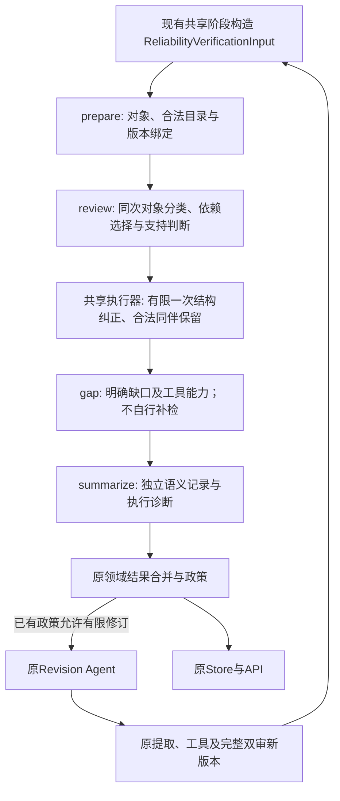

# 候选事实审核实际节点

```mermaid
flowchart TD
 I[现有共享阶段构造 ReliabilityVerificationInput] --> P[prepare: 对象、合法目录与版本绑定]
 P --> R[review: 同次对象分类、依赖选择与支持判断]
 R --> C[共享执行器: 有限一次结构纠正、合法同伴保留]
 C --> G[gap: 明确缺口及工具能力；不自行补检]
 G --> S[summarize: 独立语义记录与执行诊断]
 S --> O[原领域结果合并与政策]
 O -->|已有政策允许有限修订| V[原Revision Agent]
 V --> E[原提取、工具及完整双审新版本]
 E --> I
 O --> D[原Store与API]
```

内部图只运行prepare/review/gap/summarize；C是review调用的既有有界请求服务，不是另一个Agent。外层补检仍受原检索次数、时间和模型预算限制，无内部递归搜索。原引用各自合法目录不混入独立事实或题设。图无自动重试、远程追踪和checkpoint恢复。
