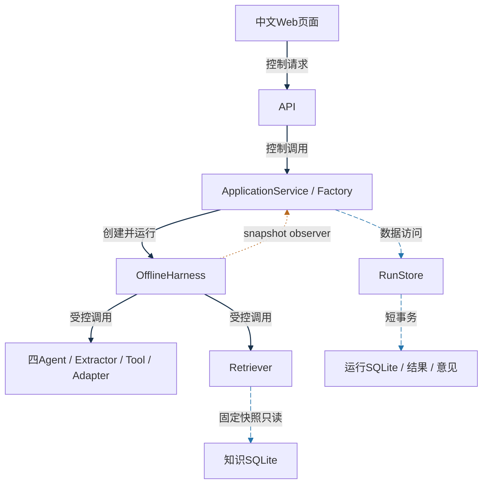
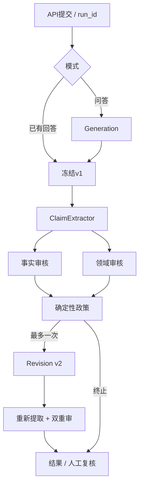

# 学习手册r1图源与关系说明

日期：2026-10-04；源码基线3d5e0cd，未修改应用。保留旧handbook-diagrams.md；新PDF使用build_handbook_pdf_r1.py的矢量图。

## 架构图

实线=控制调用；蓝色长虚线=数据访问；橙色点线=持久化观察回调。Factory构造时接收应用服务注册的observer，Harness并不直接写运行库。颜色之外同时使用线型和说明，黑白打印仍可读。

## 运行流程

流程图的箭头表示阶段顺序，不等同于架构图中的数据访问。异常可提前终止并保存有效部分，观察回调不在此图重复画出。
