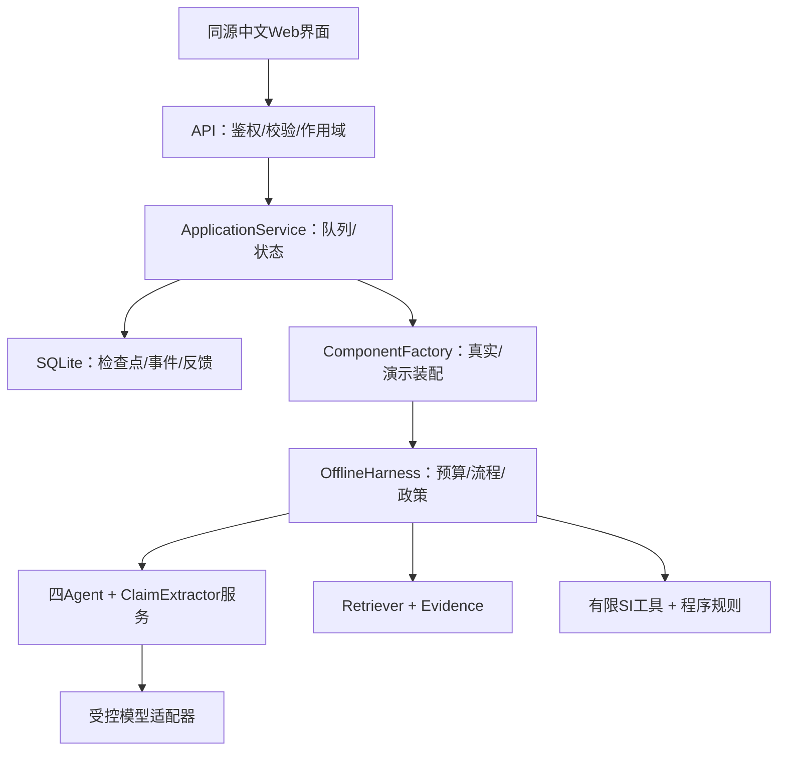
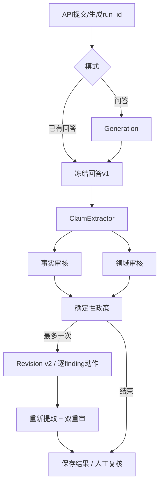

# 学习手册图源

2026-10-04，对应本机原型v0.1。PDF中的矢量图由 `tools/build_handbook_pdf.py` 绘制；下列Mermaid保留可编辑关系源。模块独立指职责分离，不表示模型统计独立。

## 架构

## 运行流程

图中省略异常边和每阶段持久化以便阅读；取消、预算耗尽、执行失败均可提前终止并保存有效部分。Revision由现有政策决定，并非每次必经阶段。
