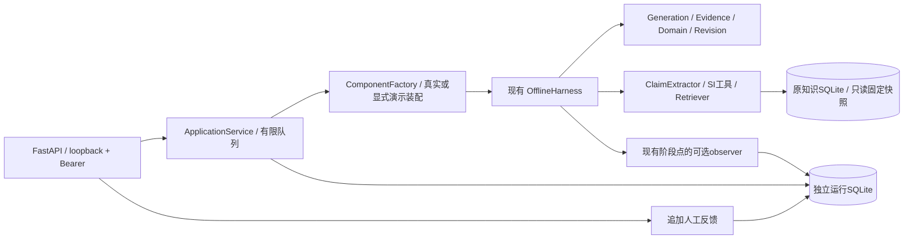

# PowerTrustAI 本机辅助审核服务 v1

2026-10-04补充：同源中文页面现已接入，见 [本机界面v1说明](local-review-ui-v1.md)。当前新增受保护的 `GET /runs/page/{offset}`（固定20条摘要），实际反馈关联与未完成轮次原引用投影，页面资产CSP及POST同源Origin检查。421项离线测试通过；两个由浏览器提交的真实API运行6/3模型请求，均review_required，详见交接与新界面说明。下面服务初交付时的“无界面/零真实调用”段落保留阶段背景，不能作为最新状态。

本版是需要人工复核的本机原型，不是可信批准或工程安全认证。复用现有 Harness、四个 Agent、单位工具、Retriever 与确定性政策，没有修改审核提示词、检索算法、知识快照、旧项目或历史记录。本轮没有真实付费模型调用。

## 依赖关系与修改清单



| 文件 | 职责 |
|---|---|
| `backend/config.py` | 绝对项目路径、服务器配置、预算、固定知识版本 |
| `backend/assembly.py` | 真实四Agent/Extractor/工具/Retriever装配；缺配置不替换为假组件 |
| `backend/service.py` | 两模式共用的提交、单活动运行、有限队列、取消、结果投影 |
| `backend/store.py` | 独立SQLite、显式JSON schema、阶段事务、对象关联、追加反馈、中断恢复标记 |
| `backend/serialization.py` | dataclass/Enum→JSON；API隐藏私有归档路径与敏感字段 |
| `backend/local_access.py` | 服务器管理的随机本地令牌；OS进程锁阻止同运行库多worker |
| `backend/api.py` | FastAPI、严格输入、HTTP状态、运行作用域、人工反馈接口 |
| `backend/__main__.py` | 仅127.0.0.1、单worker启动；真实配置使用现有绝对根目录.env加载器 |
| `backend/http_demo.py` | 实际localhost HTTP演示，提交前拒绝真实模型服务，零付费调用 |
| `backend/__init__.py` | 可选边界，包导入不强制加载HTTP框架 |
| `harness/runtime.py` | 新增可选同步observer及可选外部run_id；不改变审核调度/政策。持久化失败停止并取消同级未完成协程 |
| `harness/contracts.py` | 对现有run接口增加可选run_id；旧调用保持兼容 |
| `tests/test_local_service.py`、`tests/test_local_api.py` | 19项新增离线测试，依赖注入与假模型，不读取真实.env |
| `requirements-api.txt`、`requirements-api.lock.txt` | 独立可选API依赖及实际验证的传递依赖版本 |
| `.env.example`、`.gitignore`、`README.md` | 无密钥配置示例、私有资料/旧仓库边界和运行说明链接 |

服务没有依赖 evaluation 目录实验脚本，也没有创建另一套审核政策。真实服务显式使用：Generation schema3、ClaimExtractor protocol7、事实审核schema12、领域审核protocol4、Revision protocol2、scalar-si-conversion-v2、LimitedRepairPolicy；最多一轮修订、完整重提取和双重审仍由原 Harness 决定。

每次运行保存代码文件SHA-256、提示/契约/规则版本、非敏感模型设置、预算和固定knowledge_version。真实事实提示为 `evidence-verification-v9.4-standalone-templates`，响应契约为 `evidence-verification-output-v9.4`，不会因默认参数退回schema11。演示记录使用fake-v1，不把可用的真实协议版本写成演示已使用的协议。

## Git边界

新项目 `D:\PowerTrustAI` 不属于父仓库，本轮执行了 `git init`；没有提交、推送、重写历史或配置全局safe.directory。当前所有原新项目代码和本轮改动为未跟踪文件，不能把整个 `git status` 当作仅本轮新增文件清单；本轮清单见上表。

历史项目 `D:\PowerTrustAI\power-system-hallucination-risk-assessor` 有独立Git仓库。仅用命令级safe.directory进行只读检查，未修改旧仓库，整个目录在新仓库中忽略。新仓库尚无已跟踪文件；旧仓库的 `.env`、`.env.*`、`*.key`、`*.pem` 路径检查无已跟踪项，没有读取文件内容。

`.env`和`.env.*`忽略，`.env.example`允许提交；`.venv`、整个data目录、SQLite/DB、模型权重、私钥文件、日志及旧项目忽略。官方原文件、派生包、向量索引、实际消息/响应、访问令牌和运行输出都不会进入新Git。本轮没有运行git add。

## 安装与启动

实际环境为 `D:\PowerTrustAI\.venv\Scripts\python.exe`，Python 3.13.2 / Windows。已安装并验证FastAPI 0.115.12、Uvicorn 0.34.2、Starlette 0.46.2、Pydantic 2.13.5（pydantic-core 2.46.5）；其余精确版本见lock文件。只安装最小框架，没有安装standard extras、模型或云组件。

```powershell
cd D:\PowerTrustAI
.\.venv\Scripts\python.exe -m pip install -r requirements-api.lock.txt

# 明确演示配置，不读取.env，不使用真实模型或真实检索。
.\.venv\Scripts\python.exe -m backend --demo --port 8765

# 另一个PowerShell窗口：演示会先确认服务确实为synthetic_fixture。
.\.venv\Scripts\python.exe -m backend.http_demo --port 8765
```

真实服务启动方式（本轮没有启动真实模式或提交付费任务）：

```powershell
cd D:\PowerTrustAI
.\.venv\Scripts\python.exe -m backend --port 8765
```

入口按绝对项目路径加载已有 `.env`，仅解析KEY=VALUE、现有环境变量优先。API不接受API key、base URL、模型ID、数据库路径、文件路径或SQL。服务器固定官方DeepSeek URL，模型ID从本机 `DEEPSEEK_MODEL_ID` 配置读取；缺模型配置/索引/固定版本时提交返回503，不切换假Agent。

默认知识库为 `data/retrieval_local/semantic/corpus.sqlite3`，使用当前基线固定快照：

`k-182e01fab54ebfada841fb108061c127273e9cfcd551b6f5a8888a769215e385`

可以在服务器环境设置 `POWERTRUST_KNOWLEDGE_VERSION` 指定另一个已存在的完整固定快照；运行中不会读取latest或切换版本，修订沿用本次版本。默认仍为既有BM25与默认RetrievalSettings/相邻上下文顺序，没有采用术语扩展、reranker或cross_page_next_first。

队列默认等待容量2，可通过服务器 `POWERTRUST_QUEUE_CAPACITY` 设置1～16。运行预算：模型槽40、工具40、检索12、最多1轮修订、总800秒、步骤110秒、检索单次16000字符/累计160000字符；模型连接90秒、输出8000 tokens/96000字符。格式纠正仍走现有计费预算，服务不新增重试。预算不足的合法部分保留，不保证每种任意长度任务都完成全部阶段。

## 本机令牌与Swagger

首次启动生成32字节随机令牌，服务器私有文件为：

`D:\PowerTrustAI\data\runtime_local\access-token`

重启复用该令牌，不打印到日志，不写进报告、URL或Git。持有令牌的本机用户可访问业务接口；这是本机单用户机制，不是多用户登录或专家身份认证。不开放CORS，拒绝非本机来源/Host，拒绝query参数；服务仅绑定127.0.0.1。不要用多workers、reload或公网代理部署本版。

PowerShell只将令牌保存到变量，不把变量或请求头打印出来：

```powershell
$localToken = (Get-Content -LiteralPath D:\PowerTrustAI\data\runtime_local\access-token -Raw).Trim()
$headers = @{ Authorization = "Bearer $localToken" }
$api = "http://127.0.0.1:8765"
```

浏览器访问 `http://127.0.0.1:8765/docs`，点击Authorize，输入本机令牌（HTTPBearer字段只输入令牌，不重复Bearer）。文档和无敏感配置的health公开，业务接口均受令牌保护。Swagger默认由框架加载CDN资源；离线时可直接使用PowerShell，不需要前端。

## API与两种模式示例

| 接口 | 语义 |
|---|---|
| GET /health | 本地配置/存储与队列检查，不调用模型，不返回环境变量值 |
| POST /runs | 输入+配置预检，持久化queued后返回202/run_id |
| GET /runs/{run_id} | queued/running/finished/failed/cancelled/interrupted、时间、持久化标记 |
| GET /runs/{run_id}/result | 完整或有效部分结果；尚无阶段结果返回202和明确原因 |
| GET /runs/{run_id}/trace | 已持久化的阶段事件和有效stage_output |
| GET /runs/{run_id}/evidence/{evidence_id} | 只查询该运行关联Evidence；保留原文、来源、页和区间 |
| POST /runs/{run_id}/cancel | 持久化取消请求，合作式取消；不保证远程请求强制终止 |
| POST /runs/{run_id}/reviews | 追加反馈；回答版本和finding绑定校验 |
| GET /runs/{run_id}/reviews | 按时间返回反馈，不改模型判断 |

业务请求体额外字段拒绝，输入422；令牌401；未知/跨运行记录404；反馈版本/关联错误409；等待队列满429；配置或存储不可用503。不会把数据库异常或缺配置变成业务事实否定。

以下演示请求有synthetic_fixture标记；在真实模式下提交则会调用真实模型，应由用户明确选择。

```powershell
# 问答
$body = @{
  mode = "question_answer"
  question = "Does normal bus voltage alone prove voltage stability?"
  user_context = "synthetic_fixture; no actual plant study"
  engineering_context = @{ goal = "conceptual" }
} | ConvertTo-Json -Depth 10
$submitted = Invoke-RestMethod -Method Post -Uri "$api/runs" -Headers $headers -ContentType "application/json" -Body $body
$runId = $submitted.run_id
Invoke-RestMethod -Uri "$api/runs/$runId" -Headers $headers
$result = Invoke-RestMethod -Uri "$api/runs/$runId/result" -Headers $headers

# 审核已有回答；程序生成answer_id/version，不允许伪造来源绑定。
$body2 = @{
  mode = "assess_existing"
  question = "Is this statement supported?"
  existing_answer = "Normal bus voltage proves voltage stability."
  user_context = "synthetic_fixture constructed error, not a naturally generated error"
  references = @(@{ label = "user supplied reference"; text = "Normal voltage does not alone establish voltage stability." })
  engineering_context = @{ goal = "conceptual" }
} | ConvertTo-Json -Depth 10
$submitted2 = Invoke-RestMethod -Method Post -Uri "$api/runs" -Headers $headers -ContentType "application/json" -Body $body2
```

references始终是user_reference、未核实来源，无出版信息或索引provenance，不冒充官方资料；既有回答无生成快照时，按原协议保留输入覆盖无法评估。首版不接受上传文件、外部snapshot、原citation结构或历史JSON导入；旧实验数据未批量迁移。

结果按 execution、decision、answer、findings、evidence、snapshots、model_usage、budget_usage、limitations 分开。执行完成不表示每个技术问题已核实；`all_required_checks_assessed` 与执行完成分开。model_fact、domain的origin、program_rules、tools分别保留，检索分数不转换成支持度。演示pass只表示假组件与原政策接线完成，不能证明真实审核能力；真实服务沿用LimitedRepairPolicy和人工复核边界，不提供绿色“可信批准”。

```powershell
$result = Invoke-RestMethod -Uri "$api/runs/$runId/result" -Headers $headers
Invoke-RestMethod -Uri "$api/runs/$runId/trace" -Headers $headers
$evidenceId = $result.evidence[0].evidence_id
Invoke-RestMethod -Uri "$api/runs/$runId/evidence/$evidenceId" -Headers $headers

# 必须使用该运行实际返回的回答ID和版本。
$feedback = @{
  answer_id = $result.answer.final.answer_id
  answer_version = $result.answer.final.version
  action = "pending" # confirm / disagree / pending / note
  reviewer_id = "local-user"
  source = "ai_assisted_user_supervised" # 或user
  note = "Needs visual source review; not an expert label."
} | ConvertTo-Json
Invoke-RestMethod -Method Post -Uri "$api/runs/$runId/reviews" -Headers $headers -ContentType "application/json" -Body $feedback
Invoke-RestMethod -Uri "$api/runs/$runId/reviews" -Headers $headers
Invoke-RestMethod -Method Post -Uri "$api/runs/$runId/cancel" -Headers $headers
```

finding_id可选，使用结果中的实际ID。可以复核该运行保存的历史版本，但必须精确绑定对应版本，不能将v2 finding绑定到v1或跨运行绑定。反馈追加、来源与本地复核者声明保留，不改变策略，不自动形成human_confirmed、专家金标准或训练标签。

## 存储、重启、取消及部分失败

运行库 `data/runtime_local/runs.sqlite3` 与知识库分开，schema=`local-review-service-v1`，显式JSON，不用pickle。runs保存输入、固定配置、状态、时间、最新有效snapshot和最终结果；events追加阶段输出；objects按运行/对象ID/回答版本绑定；reviews追加反馈。回答、Evidence、主张和工具ID的冲突拒绝；审核执行占位与后续结果的进展保留在不可覆盖的events中。

每次提交、阶段checkpoint和最终写入都有独立短事务。阶段event、输出索引和最新snapshot原子保存；模型请求期间不持数据库事务。本版SQLite连接属于应用事件循环线程，短事务同步执行；不用于高并发服务。原RAG连接仍在其专属工作线程。

有效同级结果在另一方尚未完成时可查询。进程中断保留已持久化阶段，不承诺持久化尚在网络中的响应。重启将遗留queued/running改为interrupted，绝不重新排队或发付费请求；用户主动提交新任务得到新run_id。HTTP提交响应后客户端断开不影响后台任务，也不触发重试；用户自行重复POST会创建新任务，本版没有自动重发或幂等键。

取消请求先保存标记；排队任务直接取消并释放队列槽。活动任务走原Harness.cancel，保留当前回答/阶段结果。已发送远程请求或SQLite/Python工作线程可能继续，服务等待底层工作结束后才取下一任务，不声称强制终止。退出时未完成运行标interrupted；没有自动恢复。

数据库错误返回明确RUN_STORAGE_FAILED/persisted=false，observer失败停止运行，暂停接受新任务。数据库完全不可写时错误标记只能暂存在本进程，不能伪称错误记录已落库；重启后保留旧已提交的数据并标中断。需要人工检查存储，不自动恢复或重发模型请求。

真实原始消息/候选/响应保存在服务器私有 `data/retrieval_local/service_private/{run_id}`，沿用原安全归档机制。API仅给脱敏诊断和archive_ref，不能通过API读取任意本机路径或完整原响应。原Evidence文本不修改，服务器路径等非正文元数据只在公开投影中隐藏；内部索引回查仍用完整原记录。

## 实际验证结果

- 项目Python 3.13.2运行417项测试全部通过（原398项＋新增19项），55.679秒；普通测试不联网、不读真实.env、不调用付费API。
- 明确模拟缺失fastapi/starlette/pydantic/uvicorn导入后，纯离线Harness仍运行completed；pip check无依赖冲突。
- 19项新测试覆盖两模式、schema12真实装配、缺配置、版本/部分失败持久化、Evidence作用域、反馈不覆盖、队列、取消、重启、存储失败、令牌、任意路径拒绝、实际SI工具及运行中同级结果。
- 最终真实localhost HTTP演示：问答run `0adc41d24350489e9ec47cdcc9373493`，已有回答run `8b2703fe9ecf458ab07d11de1ab8e707`；分别16/11个轨迹事件；202提交→finished→200结果，Evidence原文一致；反馈201，错误版本409，未授权401。
- 进程级停止/重启验证：前一次演示的两份结果逐字段相等、各一条反馈保留，没有再次提交或执行模型任务。测试中的queued/running恢复均标interrupted，假组件未执行。
- 真实付费请求0；演示结果不能用于模型准确率或工程安全结论。本轮演示服务器已停止。

私有实际HTTP记录：`data/runtime_local/http-demo-bab0e40a44814ec8925ab29baaf8f225.json`；进程重启记录：`data/runtime_local/http-restart-verification-v1.json`。均被Git忽略。

```powershell
cd D:\PowerTrustAI
.\.venv\Scripts\python.exe -m unittest discover -s tests
.\.venv\Scripts\python.exe -m pip check
```

HTTP测试需要可选httpx（本机已有0.28.1）；未安装API框架时HTTP测试跳过，纯服务/原Harness测试仍可运行。没有安装额外测试或模型组件。

## 已知限制及下一步

本版仅本机、单用户、单进程；没有前端、公网部署、多worker、自动恢复、历史批量导入、付费请求自动重发或用户身份认证。令牌文件及运行资料依赖本机账号的文件访问边界，不承诺公网安全。

已知模型限制仍是核验对象转换、忠实性与事实支持混淆、真实数量类别判断不稳定及纠正后可能结构失败；未修提示词，未微调，未开展检索或新付费实验。领域规则仍是演示规则，无工程仿真。

下一轮最小界面可直接使用本API：任务提交、状态/取消、回答版本和逐finding证据、人工反馈表单。应清楚区分执行失败、证据不足和缺工程前提；不增加总分、绿色可信批准或工程安全认证。本轮没有实现该界面。
